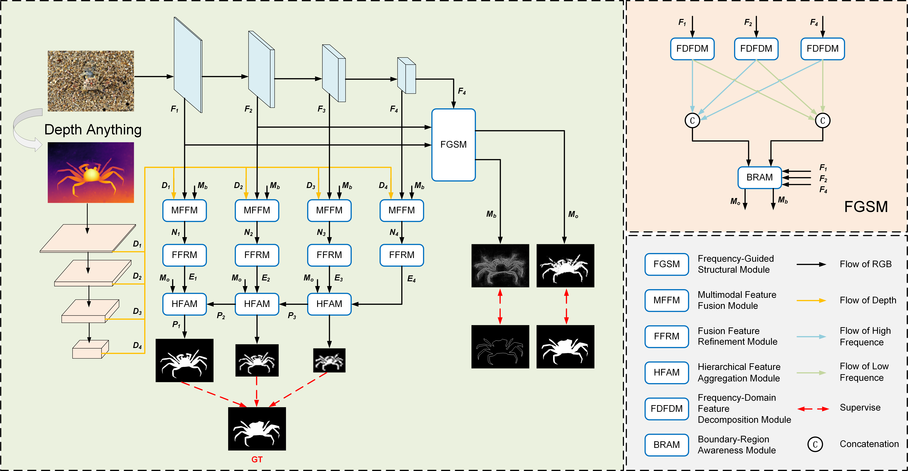
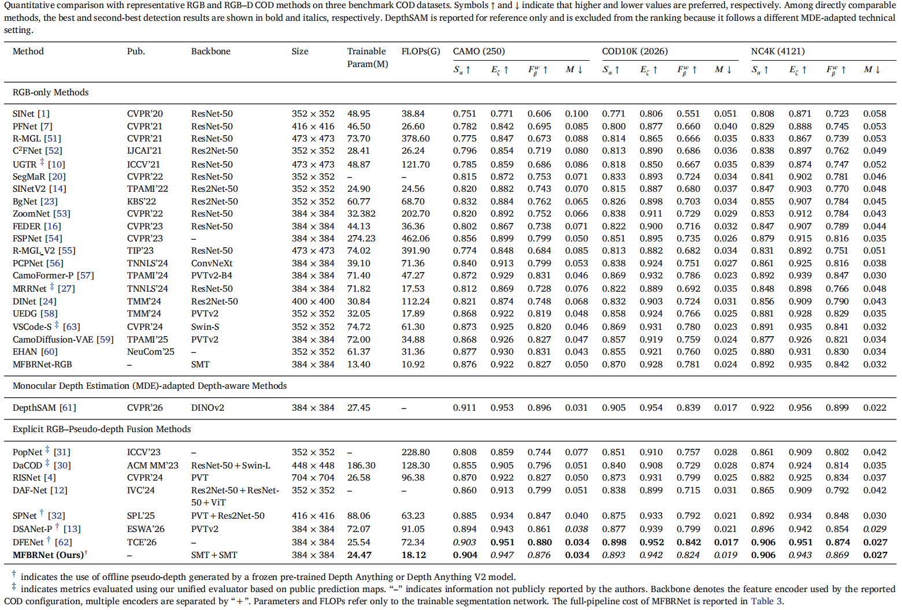
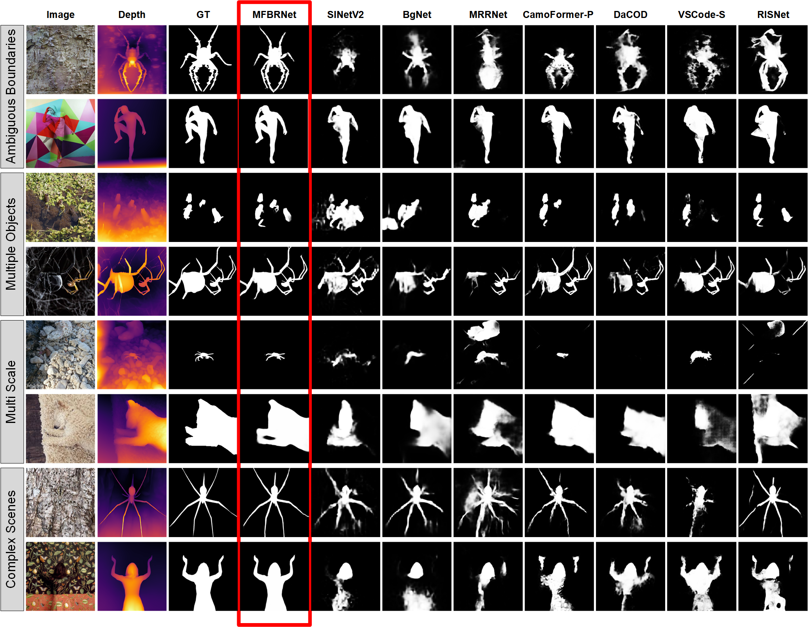

# MFBRNet

Official PyTorch implementation of **Multimodal frequency-guided boundary–region network for camouflaged object detection**, *Information Sciences*, 761 (2027), 124151. [[Paper]](https://doi.org/10.1016/j.ins.2026.124151)

**Authors:** Ziyang Liu, Fugui Luo, and He Xiao.

## Overview

MFBRNet integrates RGB appearance and pseudo-depth for camouflaged object detection. Frequency-derived boundary and region cues guide multimodal fusion and hierarchical feature aggregation to improve boundary accuracy and region completeness.



## Results

**Quantitative comparison**



**Qualitative comparison**



## Downloads

| Resource                           | Link                                                         |  Code  |
| :--------------------------------- | :----------------------------------------------------------- | :----: |
| Dataset (`data.zip`)               | [Baidu Netdisk](https://pan.baidu.com/s/1tvQ2-mC_6UO9E7mTKmAnKg?pwd=44hd) | `44hd` |
| SMT-Tiny backbone (`smt_tiny.pth`) | [Baidu Netdisk](https://pan.baidu.com/s/1b6kHPqXUxh139Wxc8nUdjg?pwd=98w4) | `98w4` |
| MFBRNet weights (`best.pth`)       | [Baidu Netdisk](https://pan.baidu.com/s/1Jm31r9UAzhkNzyqM0Xlu-w?pwd=r8ba) | `r8ba` |
| Prediction maps                    | [Baidu Netdisk](https://pan.baidu.com/s/1TgadsEjObnpsEtFGlNhifw?pwd=y2tj) | `y2tj` |

## Usage

### 1. Environment

```bash
conda create -n mfbrnet python=3.11 -y
conda activate mfbrnet
pip install torch==2.7.1 torchvision==0.22.1 --index-url https://download.pytorch.org/whl/cu118
pip install -r environment_report.txt
```

The experiments were conducted on a single NVIDIA RTX 4090 GPU (24 GB). Run the following commands from the repository root.

### 2. Data preparation

Extract `data.zip` into `./data/`:

- `TrainDataset/` should contain `Imgs/`, `GT/`, `Depth/`, and `Edge/`.
- `TestDataset/` should contain `CHAMELEON/`, `CAMO/`, `COD10K/`, and `NC4K/`, each with `Imgs/`, `GT/`, and `Depth/`.

Use the supplied pseudo-depth maps, generated offline with Depth Anything V2-Large. Data paths and training settings can be changed in `config.py`.

### 3. Training

Place `smt_tiny.pth` in the repository root, then run:

```bash
python train.py
```

Checkpoints are saved to `save_pth/`.

### 4. Inference and evaluation

Place `best.pth` in the repository root, then run:

```bash
python inference.py
python evaluate.py
```

Prediction maps are saved to `prediction_maps/`. To evaluate your own checkpoint, update `pth_path` in `inference.py` (e.g., `save_pth/best.pth`).

## Citation

If you find this work useful, please cite:

```bibtex
@article{liu2027mfbrnet,
  title   = {Multimodal frequency-guided boundary-region network for camouflaged object detection},
  author  = {Liu, Ziyang and Luo, Fugui and Xiao, He},
  journal = {Information Sciences},
  volume  = {761},
  pages   = {124151},
  year    = {2027},
  doi     = {10.1016/j.ins.2026.124151}
}
```

## Acknowledgements

We thank the authors of [SMT](https://github.com/AFeng-x/SMT), [Depth Anything V2](https://github.com/DepthAnything/Depth-Anything-V2), and [PySODMetrics](https://github.com/lartpang/PySODMetrics) for their public resources.
